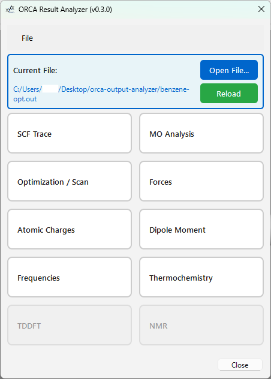
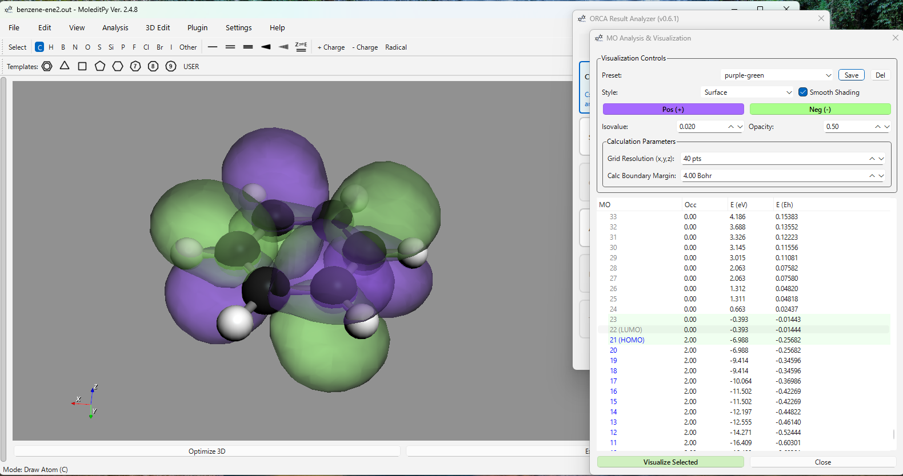
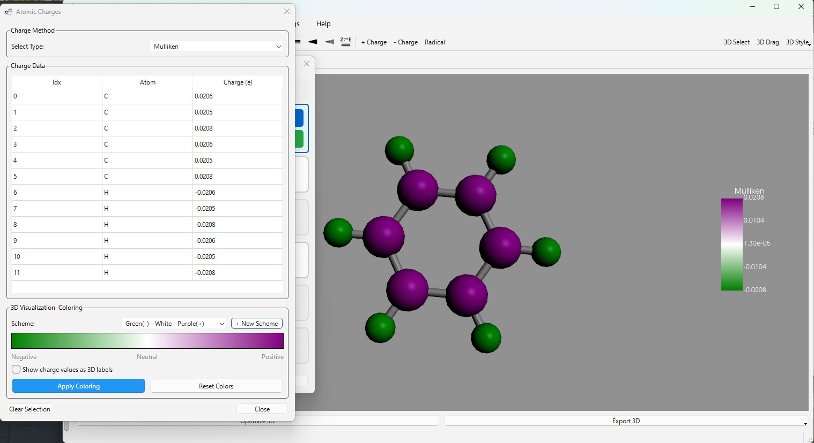
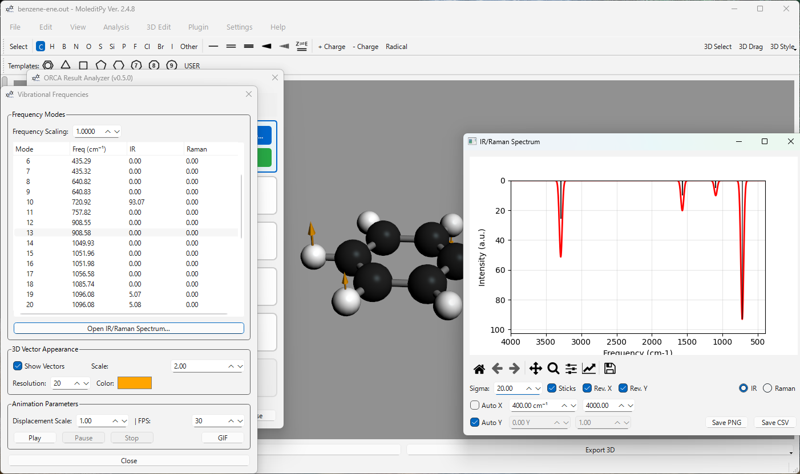
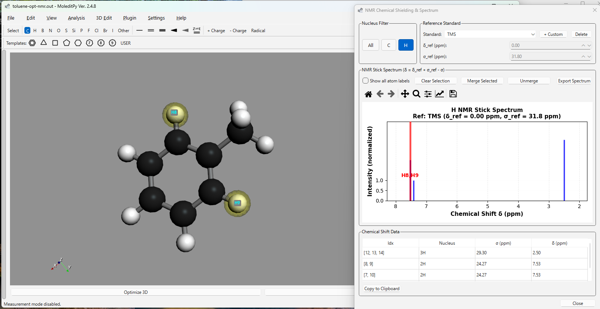

# MoleditPy ORCA Result Analyzer Plugin

A comprehensive plugin for MoleditPy to analyze and visualize results from ORCA quantum chemistry calculations.

Repo: [https://github.com/HiroYokoyama/moleditpy_orca_result_analyzer_plugin](https://github.com/HiroYokoyama/moleditpy_orca_result_analyzer_plugin)



## Features

### 1. SCF Trace
Real-time convergence visualization for SCF energy cycles.
- **Concatenated View**: View a single continuous plot of all SCF cycles throughout the calculation.
- **Interactive Tools**: Full zoom, pan, and save support via an integrated Matplotlib toolbar.

### 2. MO Analysis
- **Levels**: View orbital energies and occupancy with HOMO/LUMO identification.
- **Visualization**: Generate 3D Cubes (isosurfaces) with **Smooth Shading** and adjustable opacity.
- **Presets**: Save and manage visualization presets (colors, isovalues, styles).
- **Advanced Support**: Successfully handles S, P, D, F, and G shells (L=4).
- **Feedback**: Integrated warning system identifies missing ORCA output keywords required for cube generation.



### 3. Optimization / Scan
Analyze **Geometry Optimizations** and **Relaxed Surface Scans**.
- **Interactive Graph**: Plot Energy vs. Step. Click points to update the 3D structure.
- **Display Modes**: Toggle between **Absolute** and **Relative** energy (kJ/mol, kcal/mol, eV, Eh).
- **Log Scale**: Supports log-scale visualization for relative energy changes.
- **Animation**: Play/Pause trajectory animations with adjustable FPS.
- **Export**: Save plots as images or export the full 3D animation as high-quality **GIFs**.


### 4. Forces
Analyze structural forces for the current structure or the entire trajectory.
- **Historical Gradients**: Capture and display force vectors for **every** step of an optimization or scan.
- **Visualization Controls**: **Auto Scale** feature automatically optimizes vector size for visibility, especially for small gradients.
- **Step-by-Step Navigation**: Precise control with `<` and `>` buttons or the trajectory slider.
- **Convergence Tracking**: Multi-line display of **RMS/MAX Gradient** and **RMS/MAX Step**, color-coded (**Green for YES**, **Red for NO**).
- **Data Table**: Full breakdown of gradients, force components, and magnitudes.

### 5. Atomic Charges
- **Populations**: Mulliken, Loewdin, Hirshfeld, and **NBO** populations (if available).
- **3D Coloring**: Color atoms in the 3D viewer based on charge value or population type.



### 6. Dipole Moment
- **Vector Visualization**: Display the total dipole moment vector magnitude and direction in the 3D viewer.

### 7. Frequencies
Visualize vibrational modes and spectra.
- **IR/Raman**: Stick and broadened spectra plots with interactive peak labels.
- **Visualization**: Animated vibrational modes with vector arrows.



### 8. Thermochemistry
Detailed analysis of thermodynamic properties based on frequency calculations.
- **Broad Summary**: Electronic Energy, ZPE, Enthalpy (H), Gibbs Free Energy (G).
- **Detailed Corrections**: Optional breakdown of **vibrational, rotational, and translational** contributions to energy and entropy.

### 9. TDDFT
Analyze electronic excitations and absorption spectra.
- **Spectra**: **Absorption** and **CD** (Circular Dichroism) spectra with Gaussian broadening.
- **Controls**: Adjustable broadening (Sigma) and peak-stick overlays.

### 10. NMR
Advanced NMR chemical shielding validation and visualization.
- **Stick Spectrum**: Nucleus-specific stick spectra (1H, 13C, etc.) with experimental reference standards (TMS, CDCl3, DMSO-d6, etc.).
- **Multiplet Simulation**: Realistic J-coupling splitting patterns and first-order multiplicity calculations with adjustable Lorentzian line-widths.
- **Custom References**: Add and manage custom reference standards (delta_ref and sigma_ref).
- **Equivalent Atom Merging**: Manually or automatically merge equivalent atoms into single peaks with persistent storage.
- **Interactive Sync**: Robust bidirectional synchronization—selecting peaks in the spectrum highlights atoms in 3D (and vice-versa).



## Interface & Usability
- **Logical Workflow**: Buttons grouped by task: Electronic -> Geometry -> Properties -> Spectroscopy.
- **Modeless Design**: All analysis windows are modeless, allowing side-by-side comparison and 3D viewer interaction.
- **Keyboard Shortcuts**: `Ctrl+O` (Open), `Ctrl+R` (Reload), `Ctrl+W` (Close Window).
- **Persistence**: Remembers your presets, NMR references, and merged peaks across sessions.

## Installation
Download from [Plugin Explorer](https://hiroyokoyama.github.io/moleditpy-plugins/explorer/?q=ORCA+Result+Analyzer).  

Ensure the `orca_result_analyzer` folder is placed in your MoleditPy plugins directory.

## Requirements
- **ORCA Output**: Reads `.out` or `.log` files. Basis set info (`Print[P_Basis] 2`) is required for MO Cube generation.
- **Dependencies**: `rdkit`, `matplotlib`, `Pillow` (PIL), and `pyvista` (for 3D vectors). `nmrsim` is optional (for J-coupling simulation). 

## Required ORCA Keywords

**For MO Cube Generation:**

```text
%output
  Print[P_Basis] 2  # Required for Basis Set parsing
  Print[P_Mos] 1    # Ensure MO coefficients are printed
end

```

**For NMR Simulation (J-Coupling):**

```text
%eprnmr
  Nuclei = all H { shift, sscoupling } # Required for J-coupling (nmrsim)
end

```
```
*Note: Standard output is usually sufficient for Geometry and Energies, but Basis Set information is strictly required for generating cubes.*

