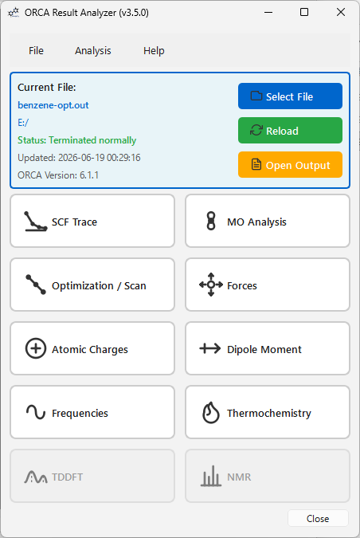
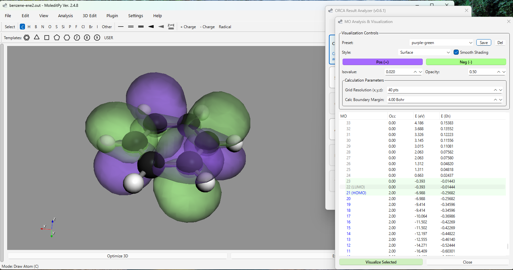
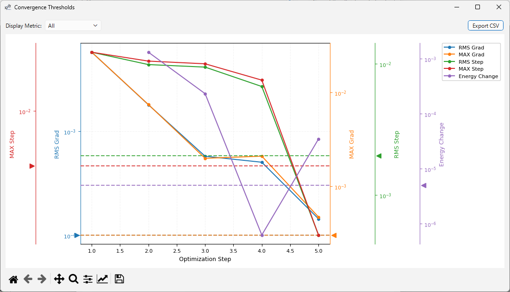
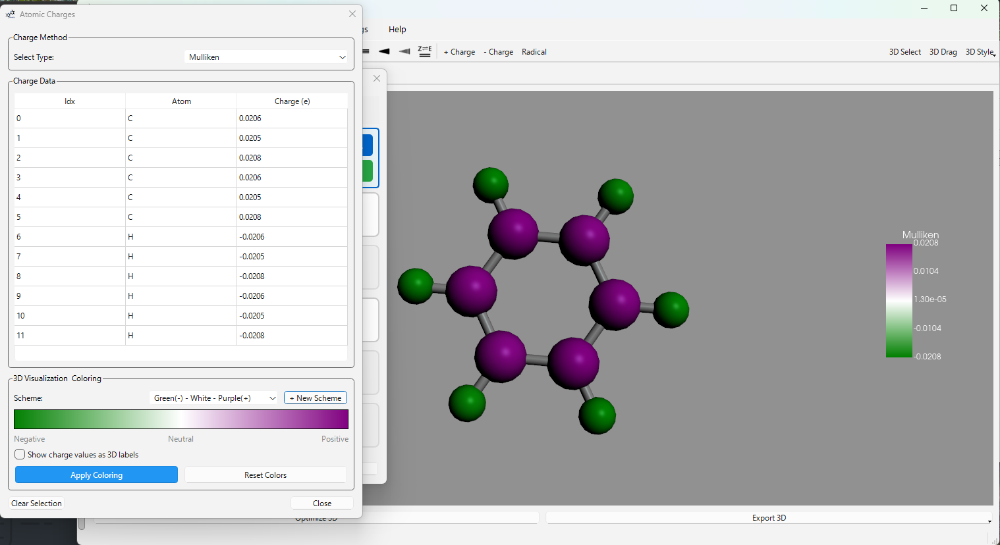
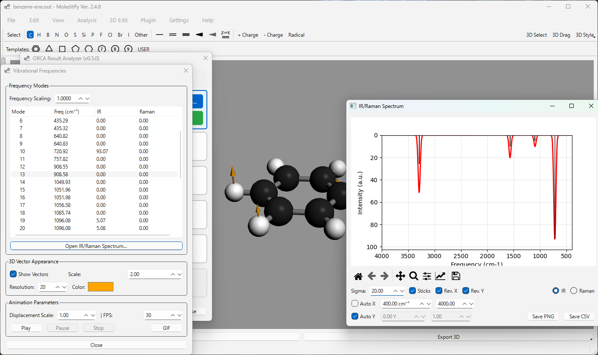
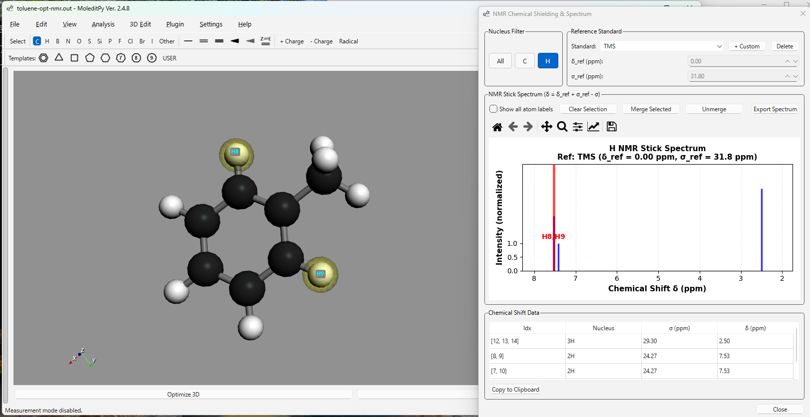

# MoleditPy ORCA Result Analyzer Plugin

[](https://doi.org/10.5281/zenodo.20726011)
[](https://github.com/HiroYokoyama/moleditpy_orca_result_analyzer_plugin/actions/workflows/tests.yml)
[](https://github.com/sponsors/HiroYokoyama)

A comprehensive plugin for MoleditPy to analyze and visualize results from ORCA quantum chemistry calculations.

Repo: [https://github.com/HiroYokoyama/moleditpy_orca_result_analyzer_plugin](https://github.com/HiroYokoyama/moleditpy_orca_result_analyzer_plugin)



## Features

### 1. SCF Trace
Real-time convergence visualization for SCF energy cycles.
- **Concatenated View**: View a single continuous plot of all SCF cycles throughout the calculation.
- **Interactive Tools**: Full zoom, pan, and save support via an integrated Matplotlib toolbar.

### 2. MO Analysis
- **Levels**: View orbital energies and occupancy with HOMO/LUMO identification.
- **Visualization**: Generate 3D Cubes (isosurfaces) with **Smooth Shading** and adjustable opacity.
- **Presets**: Save and manage visualization presets (colors, isovalues, styles).
- **Advanced Support**: Successfully handles S, P, D, F, and G shells (L=4).
- **Feedback**: Integrated warning system identifies missing ORCA output keywords required for cube generation.



### 3. Optimization / Scan
Analyze **Geometry Optimizations** and **Relaxed Surface Scans**.
- **Interactive Graph**: Plot Energy vs. Step. Click points to update the 3D structure.
- **Display Modes**: Toggle between **Absolute** and **Relative** energy (kJ/mol, kcal/mol, eV, Eh).
- **Log Scale**: Supports log-scale visualization for relative energy changes.
- **Animation**: Play/Pause trajectory animations with adjustable FPS.
- **Export**: Save plots as images or export the full 3D animation as high-quality **GIFs**.


### 4. Forces
Analyze structural forces for the current structure or the entire trajectory.
- **Historical Gradients**: Capture and display force vectors for **every** step of an optimization or scan.
- **Visualization Controls**: **Auto Scale** feature automatically optimizes vector size for visibility, especially for small gradients.
- **Step-by-Step Navigation**: Precise control with `<` and `>` buttons or the trajectory slider.
- **Convergence Tracking**: Multi-line display of **RMS/MAX Gradient** and **RMS/MAX Step**, color-coded (**Green for YES**, **Red for NO**).
- **Modeless Threshold Graph**: View a non-blocking convergence threshold plot across all optimization steps. The graph features color-matched Y-axes for each metric and easy dropdown metric selection.
- **Data Table**: Full breakdown of gradients, force components, and magnitudes.



### 5. Atomic Charges
- **Populations**: Mulliken, Loewdin, Hirshfeld, and **NBO** populations (if available).
- **3D Coloring**: Color atoms in the 3D viewer based on charge value or population type.



### 6. Dipole Moment
- **Vector Visualization**: Display the total dipole moment vector magnitude and direction in the 3D viewer.

### 7. Frequencies
Visualize vibrational modes and spectra.
- **IR/Raman**: Stick and broadened spectra plots with interactive peak labels.
- **Visualization**: Animated vibrational modes with vector arrows.



### 8. Thermochemistry
Detailed analysis of thermodynamic properties based on frequency calculations.
- **Broad Summary**: Electronic Energy, ZPE, Enthalpy (H), Gibbs Free Energy (G).
- **Detailed Corrections**: Optional breakdown of **vibrational, rotational, and translational** contributions to energy and entropy.

### 9. TDDFT
Analyze electronic excitations and absorption spectra.
- **Spectra**: **Absorption** and **CD** (Circular Dichroism) spectra with Gaussian broadening.
- **Controls**: Adjustable broadening (Sigma) and peak-stick overlays.

### 10. NMR
Advanced NMR chemical shielding validation and visualization.
- **Stick Spectrum**: Nucleus-specific stick spectra (1H, 13C, etc.) with experimental reference standards (TMS, CDCl3, DMSO-d6, etc.).
- **Multiplet Simulation**: Realistic J-coupling splitting patterns and first-order multiplicity calculations with adjustable Lorentzian line-widths.
- **Custom References**: Add and manage custom reference standards (delta_ref and sigma_ref).
- **Equivalent Atom Merging**: Manually merge equivalent atoms into single peaks with persistent storage.
- **Interactive Sync**: Robust bidirectional synchronization—selecting peaks in the spectrum highlights atoms in 3D (and vice-versa).



### 11. Bond Analysis
Comprehensive bonding and orbital analysis:
- **Mayer Bond Orders**: View and inspect parsed Mayer bond-order matrix values in a clean tabular view.
- **NBO Orbitals & Hybridization**: Full breakdown of Natural Bond Orbitals (NBO) list with hybridization composition (%s / %p / %d / %f per atom). Double-clicking an entry displays the raw NBO details.
- **E(2) Perturbation**: Tabulate donor-acceptor second-order perturbation energy \(E^{(2)}\) interaction values.
- **3D Viewer Integration**: Selecting rows in any bond analysis table automatically highlights the involved atom(s) in the 3D viewport.

### 12. Post-HF Energies & Properties
- **Post-HF Energy Components**: Separate panel displaying Reference Energy, Correlation Energy (MP2, CCSD), and Triples Correction (CCSD(T)) components.
- **Properties**: Parse and display physical parameters such as spin contamination expectation values (\(\langle S^2 \rangle\)) and dispersion corrections.

## Interface & Usability
- **MoleditPy v4 Ready**: Fully integrated with the new `PluginContext` architecture for stable window management and safe main-window interaction.
- **Standalone Launch**: Open the analyzer at any time via **Extensions > ORCA Result Analyzer** without selecting a file first.
- **Drag-and-Drop**: Drag a `.out` file directly onto the analyzer window to open it, or drag a folder to open the "Select from Directory" picker.
- **Logical Workflow**: Buttons grouped by task: Electronic -> Geometry -> Properties -> Spectroscopy.
- **Modeless Design**: All analysis windows are modeless, allowing side-by-side comparison and 3D viewer interaction.
- **Copyable Tables**: Support selecting and copying data (via `Ctrl+C`) from analysis tables to external spreadsheet editors.
- **Interactive Highlighting**: Highlight atoms in the 3D viewer (with VDW scaling) when selecting rows in the Properties or Bond Analysis tables.
- **Keyboard Shortcuts**: `Ctrl+O` (Open File), `Shift+Ctrl+O` (Select from Directory), `Ctrl+R` (Reload), `Ctrl+W` (Close Window).
- **Persistence**: Remembers your presets, NMR references, and merged peaks across sessions.

## Installation
Download from [Plugin Explorer](https://hiroyokoyama.github.io/moleditpy-plugins/explorer/?q=ORCA+Result+Analyzer).  

Ensure the `orca_result_analyzer` folder is placed in your MoleditPy plugins directory.

## Requirements
- **MoleditPy**: Version 4.0.0 or higher.
- **ORCA Output**: Reads `.out` or `.log` files. Basis set info (`Print[P_Basis] 2`) is required for MO Cube generation.
- **Dependencies**: `rdkit`, `matplotlib`, `Pillow` (PIL), and `pyvista` (for 3D vectors). `nmrsim` is optional (for J-coupling simulation). 

## License Note on Sample Output Files

The test fixtures in `tests/sample_outputs/` are ORCA quantum chemistry output files (`.out`) generated by running [ORCA](https://orcaforum.kofo.mpg.de/) on publicly available molecular geometries (benzene, acetone).

ORCA is proprietary software distributed free for academic use under its own license. These output files are included solely as test fixtures for the parser. They are **excluded from this project's GPL-3.0 license** — they are not source code of this project and carry no additional redistribution grant beyond what the general scientific community norm considers acceptable for test data.

If you need to regenerate these files, you will need your own ORCA installation.

## Required ORCA Keywords

**For MO Cube Generation:**

*Note: Standard output is usually sufficient for Geometry and Energies, but Basis Set information is strictly required for generating cubes.*

```text
%output
  Print[P_Basis] 2  # Required for Basis Set parsing
  Print[P_Mos] 1    # Ensure MO coefficients are printed
end

```

**For NMR Simulation (J-Coupling):**

```text
! NMR

%eprnmr
  NUCLEI = ALL H {SHIFT, SSALL} # Required for J-coupling (nmrsim)
end
```

## License & Disclaimer

This project is licensed under the GNU General Public License v3.0 (GPLv3) - see the [LICENSE](LICENSE) file for details. As open-source software, it is provided 'as is' without warranty of any kind, and the author assumes no responsibility or liability for the results. Although outputs have been carefully verified, users are strongly encouraged to independently check and validate them for critical applications (such as publications). If you encounter any bugs, please open an issue.


